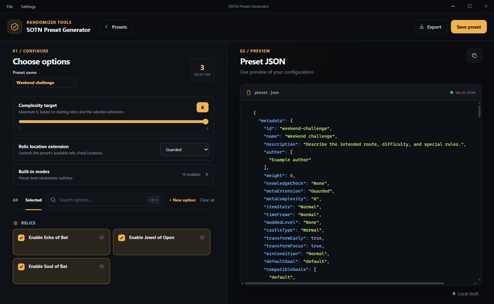
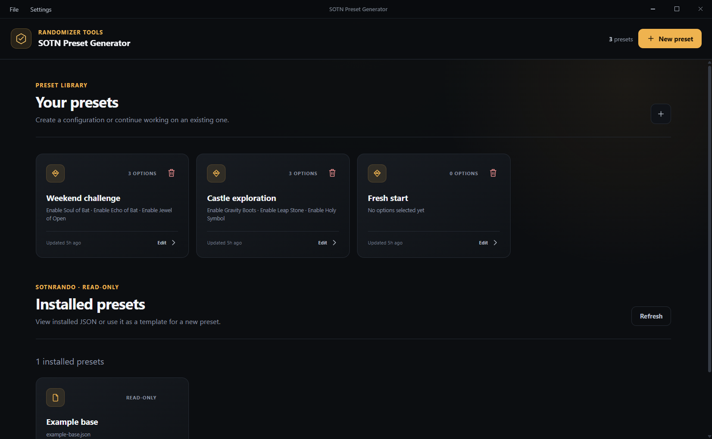
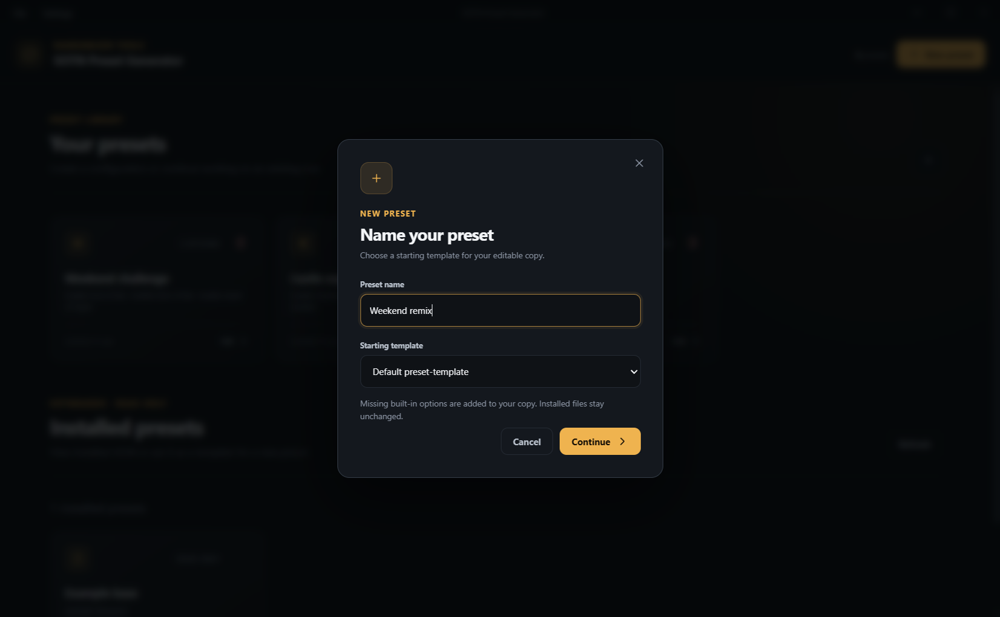
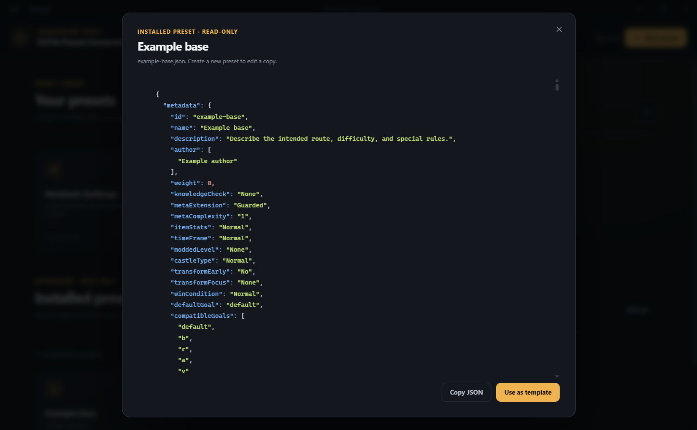
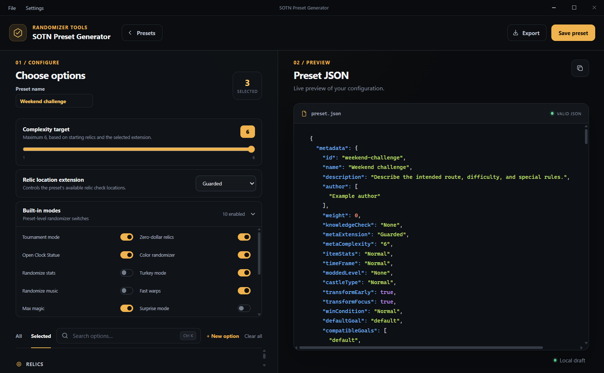
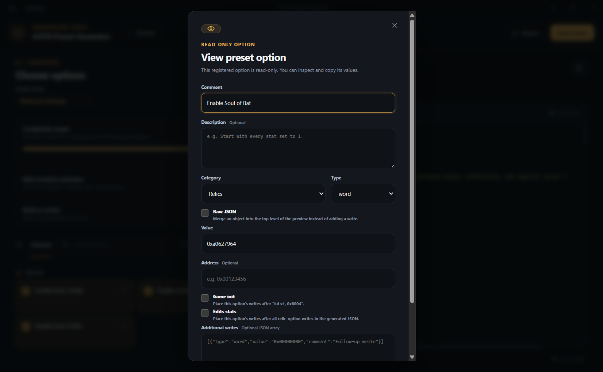

# SOTN Preset Generator

A desktop editor for assembling **Castlevania: Symphony of the Night randomizer presets**. Choose gameplay options, starting relics, a relic location extension, and a complexity target while the generated JSON updates beside your selections. Keep multiple drafts locally, use installed presets as templates, and export directly into a SOTNRando repository.



The application builds preset configuration files. Seed generation and playing the randomized game happen in your randomizer tools. You can create drafts and copy JSON without configuring SOTNRando; browsing installed presets and exporting/building require a local SOTNRando repository.

The Windows installer and portable ZIP include [sotnrando](https://github.com/sotnrando/sotnrando), its dependencies, built-in presets, and license. On first launch, the app prepares a writable `sotnrando` folder in its installation directory and selects it as the default export destination. JSON exports go into `sotnrando/presets`, then the app registers and builds them using Electron's included Node runtime; no separate Git, Node.js, npm, or download is required on the user's PC.

For Squirrel installs, the writable folder sits beside `Update.exe` and the `app-<version>` folders, so application upgrades preserve it. Portable apps use a `sotnrando` folder beside the executable; extract the ZIP into a writable directory. Existing writable randomizer installations are reused intact, including their current randomizer version and exported presets. Application upgrades do not overwrite or update that copy. Back it up before uninstalling or deleting the application folder. A directory explicitly selected through **Settings → Export directory** takes precedence over the bundled default; development mode still uses manual directory selection.

When a SOTNRando directory is configured, the library also lists the JSON files in its `presets` folder under **Installed presets**. These are read-only: you can view or copy their original JSON, or use them as a starting template in the new preset dialog. The default `preset-template` is always available. Use **Refresh** to pick up external changes; unreadable JSON files are reported separately.

## Contents

- [Getting started](#getting-started)
- [Preset library and templates](#preset-library-and-templates)
- [Configuring a preset](#configuring-a-preset)
- [Built-in modes](#built-in-modes)
- [Relic logic and complexity](#relic-logic-and-complexity)
- [Custom options](#custom-options)
- [JSON preview and export](#json-preview-and-export)
- [Settings, shortcuts, and local storage](#settings-shortcuts-and-local-storage)
- [Run locally](#run-locally)
- [Windows releases](#windows-releases)
- [Relic location reference](#relic-location-reference)
- [Tests](#tests)

## Getting started

Windows x64 installer and ZIP builds are distributed through this repository's [GitHub Releases](https://github.com/ndsmith201/SOTNPresetGenerator/releases). For development, see [Run locally](#run-locally).

1. Open the app and click **New preset**.
2. Enter a name and choose **Default preset-template**, or an installed preset if you have configured an export directory.
3. Click **Continue** to open the editor. Set the relic location extension and complexity target, expand **Built-in modes**, and select any catalog options you want.
4. Review the live **Preset JSON** pane. Changes save automatically to your local draft; **Save preset** confirms that local save.
5. Use **Copy JSON** to copy the result, or click **Export** to write and build it in SOTNRando. The first export prompts for a repository directory if one has not been selected.

Screenshots below show the current interface with example drafts and the bundled option catalog. The installed **Example base** preset is demonstration data; your installed list comes from your configured repository.

## Preset library and templates

The app opens to **Your presets**, a library of editable local drafts. Each card shows the preset's name, selected-option count, option summary, and last update time. Drafts are ordered by most recently updated. Click a card to resume editing, or use its trash button to delete it after confirmation. Deleting a local draft does not delete an exported JSON file.



Use **New preset**, the library's plus button, or **File → New preset** to create another draft. Names can contain up to 60 characters and can be changed in the editor. The name also determines the generated preset ID and export filename: for example, `Weekend challenge` becomes `weekend-challenge.json`.



### Installed presets

Choose **Settings → Export directory** and select the SOTNRando repository root. The library then displays JSON files from its `presets` folder under **Installed presets**. These entries are read-only. Open one to inspect its JSON, click **Copy JSON**, or choose **Use as template** to create an editable copy with that template already selected.



**Refresh** picks up external changes to the folder. Unreadable or invalid files are reported, while valid presets remain available. The default template is always available for new drafts.

### What a template copy preserves

A draft created from an installed preset stores its own copy of the source JSON, so it remains usable after restarting the app or changing the configured directory. Existing source settings are preserved where supported, and missing built-in settings receive the application's defaults.

Generated copies omit `inherits`; the app does not recursively resolve another preset's inherited settings. They also replace the source's `lockLocation` with the bundled template's checks for the selected extension before applying starting-relic adjustments. Review the generated JSON when adapting presets with custom inheritance or access rules.

Catalog options whose complete writes or raw JSON settings match the source are selected automatically. Matching ignores write comments and hexadecimal case or padding, but checks addresses and every write in an option. Matched options reuse source entries instead of duplicating them. Unchecking a matched option removes its effect from the generated copy; startup instructions become no-ops where needed to preserve code positions. Later deselections persist across restarts.

## Configuring a preset

The editor has two panes: **Choose options** on the left and **Preset JSON** on the right. The preview updates as you rename the preset, change settings, or toggle options.

The option catalog is organized into five categories:

| Category | Purpose |
| --- | --- |
| World & Exploration | World and traversal changes. |
| Gameplay | General gameplay modifications. |
| Items & Equipment | Item and equipment configuration. |
| Relics | Starting relic options, including transformations and movement abilities. |
| Challenge Modifiers | Options for custom challenge rules. |

The exact options depend on your local catalog and the snapshot bundled with your release. Click a checkbox or option label to toggle it. The selected count updates immediately, and descriptions are available on cards and in hover/focus tooltips.

- **Search options** filters option names and descriptions, ignoring case.
- **All / Selected** switches between the full catalog and your enabled options. Search applies to both views.
- **Clear all** deselects catalog options. It does not reset the preset name, built-in mode switches, extension, or all source-template settings. Complexity may adjust as a result.
- The **eye** button opens a registered option for inspection. The **pencil** button edits a custom option.
- **+ New option** adds a reusable option to the catalog. Select it separately to include it in a preset.

## Built-in modes

Expand **Built-in modes** above the option list to see the preset-level randomizer switches. These are separate from catalog option selections, and the collapsed panel displays how many are enabled.



These are the defaults for a new preset. An installed template's explicit boolean values are used when creating a copy.

| UI setting | JSON key | Default |
| --- | --- | --- |
| Tournament mode | `tournamentMode` | On |
| Zero-dollar relics | `zeroDollarRelicMode` | On |
| Open Clock Statue | `openClockStatueMode` | On |
| Color randomizer | `colorrandoMode` | On |
| Randomize stats | `stats` | Off |
| Turkey mode | `turkeyMode` | On |
| Randomize music | `music` | Off |
| Fast warps | `fastwarpMode` | On |
| Max magic | `magicmaxMode` | On |
| Surprise mode | `surpriseMode` | Off |
| Anti-freeze | `antiFreezeMode` | On |
| Skip prologue | `noprologueMode` | On |
| Enemy stats | `enemyStatRandoMode` | Off |
| Shop prices | `shopPriceRandoMode` | Off |
| Starting room | `startRoomRandoMode` | Off |
| 2nd Castle Starting room | `startRoomRando2ndMode` | Off |
| RLBC mode | `rlbcMode` | On |

These switches emit settings into the preset; the randomizer consuming the file determines their in-game behavior. The [JSON format reference](docs/preset-json-format.md) includes observed parser compatibility exceptions, including `tournamentMode`.

## Relic logic and complexity

**Relic location extension** selects which checks are included: **Guarded**, **GuardedPlus**, **Equipment**, **Scenic**, **Extended**, or **Classic**. The selection updates the JSON's extension fields and filters location locks to the appropriate check list. Classic emits `relicLocationsExtension: false`. See the [check lists by extension](docs/relic-location-extensions.md) for exact membership.

Starting relic options affect more than the generated inventory writes. They also adjust entry locks, escape requirements, transformation metadata, and the maximum complexity. Relics detected in a source template's standard new-game injection routine are included and shown in the editor.

The **Complexity target** slider sets `complexityGoal.min` and `metadata.metaComplexity`. Its maximum is recalculated from the selected extension's location locks and enabled starting relics. If a change lowers that maximum, both the saved target and the generated JSON are clamped automatically. If no progression remains, the target is 0 and the slider is disabled.

The calculation finds the longest sequence of pickups where each pickup opens at least one new check. Setup pickups, such as the first of two required rings, add no step. The final required Vlad pickup adds one completion step unless the required Vlads are already starting relics. Flight methods are interchangeable for movement, while distinct uses such as Mist barriers and Bat with Echo remain required.

For example, starting with only Soul of Bat allows a maximum of eight in Guarded and twelve in Equipment, Extended, or Scenic under the bundled rules. This is an access-rule maximum, not a guarantee of a particular randomized placement or a general difficulty rating.

## Custom options

Use **+ New option** to add reusable configuration to the SQLite-backed catalog. Give it a **Comment** (the name displayed on its card), an optional **Description**, and a category. New options stay editable across restarts and are available to all local presets; editing their definition affects generated output for presets that select them.



### Write options

A write option defines a `char`, `short`, `word`, `long`, or `string` value. An optional hexadecimal **Address** must begin with `0x`. **Additional writes** accepts a JSON array of objects, allowing one option to contribute a sequence of writes.

**Game init** places the option's writes after the template's `lui v1, 0x8004` initialization anchor. **Edits stats** orders its injected writes after relic-option writes. These two placement flags are mutually exclusive. Addressed writes and unaddressed injected writes follow the generator's template assembly rules; inspect the preview when authoring patches.

### Raw JSON options

Enable **Raw JSON** to enter a JSON object that merges into the top level of the preview instead of adding a write. For example:

```json
{
  "enemyDrops": true
}
```

The merge replaces matching top-level values; it is not a recursive merge of nested objects. The name, ID, complexity, selected extension, and extension check filtering are enforced by the generator after merging. Raw JSON disables the write address, write type, and write-placement fields. Invalid JSON, non-object raw JSON, and malformed additional-write arrays are rejected by the option dialog.

Registered options are read-only: use the eye button to inspect and select/copy their values. Their settings cannot be saved over from this dialog. The read-only migration marks pre-existing options as registered without changing their values or preset selections; newly created options remain editable.

## JSON preview and export

The **Preset JSON** pane displays formatted, syntax-highlighted output with a **Copy JSON** button. This is a preview, not a text editor. Use the controls or a raw JSON option to change the generated configuration.

The preview includes preset metadata, the selected extension and complexity, built-in mode values, location logic, and assembled writes. **Valid JSON** indicates the serialized configuration's syntax; it does not prove that a custom patch works in-game or that a randomizer build will succeed.

### Export to SOTNRando

Select **Settings → Export directory**, or choose a directory when prompted by your first **Export**. Select the repository root, which must contain:

```text
SOTNRando/
  package.json
  presets/
  tools/
    build-presets
```

Export performs three operations:

1. Writes formatted JSON to `presets/<preset-id>.json`, with `metadata.id` set from the preset name.
2. Adds that ID to the repository's `package.json` `presets` list if it is not already registered.
3. Runs `tools/build-presets` from that repository using Electron's Node runtime.

If the JSON file already exists, the app asks whether to **Replace** it; canceling leaves that export unperformed. To keep the existing file, rename your draft before exporting. Different display names can normalize to the same filename, so check the replacement prompt.

The button reads **Building…** while export is running. A successful export reports **Exported and built** and refreshes the installed preset list. Export is not transactional: if registration or building fails after the JSON has been written, earlier filesystem changes may remain. Read the reported error and inspect the target repository before retrying. The repository must already have the dependencies and files needed by its build script.

## Settings, shortcuts, and local storage

**Settings** provides four preferences:

| Setting | Behavior |
| --- | --- |
| Compact option cards | Uses denser cards to show more options in the list. |
| Wrap JSON lines | Wraps long lines in the JSON display. |
| Export directory | Remembers the SOTNRando root used for installed presets and export. |
| Preset author | Overrides the author in all generated presets, including existing drafts. Leave blank to use the template author. |

| Shortcut | Action |
| --- | --- |
| `Ctrl+N` | Open the new preset dialog. |
| `Ctrl+S` | Confirm the active preset is saved locally. |
| `Ctrl+K` | Focus option search while editing. |

The renderer also accepts Command on macOS. **File** provides new/save, return to the library, delete the active draft, and exit actions. **Presets** in the editor's header returns to the library.

Drafts and preferences persist automatically in the Electron renderer's local storage. Option definitions live separately in `options.sqlite`. On Windows, the application uses `%APPDATA%/sotn-preset-generator/`, retaining that data directory in packaged builds. There is no cloud synchronization. An exported preset JSON and the release's options SQL snapshot are different artifacts: the SQL snapshot contains the option catalog, not your drafts or preferences.

After a successful **Export** and build, **Generate** saves a `.ppf` patch using that exported preset. Choose the output file in the save dialog; the containing folder opens when generation succeeds. No game image is needed to create the patch. Generate is disabled until the current preset has been exported and built in this app session; hover or focus its wrapper for the export reminder. Changes to the generated JSON or export directory require a matching export, and changed or missing exported files are rejected. Export and Generate remain disabled during generation. Canceling the save dialog leaves the build available, and a failed generation keeps any existing output file intact.

The complexity slider's maximum is calculated from all location locks in the selected relic extension and the enabled starting relics. It finds the longest sequence of pickups that each opens at least one new check; setup pickups (such as the first of two required rings) add no step. The final required Vlad pickup adds one completion step unless the required Vlads are already starting relics. Flight methods are interchangeable for movement, while distinct uses such as Mist barriers and Bat with Echo remain required. For example, starting with Bat allows a maximum of eight in Guarded and twelve in Equipment, Extended, or Scenic. This is a maximum based on access rules, not a guarantee of a particular randomized placement. The target and generated JSON are clamped when the extension or starting relics lower the maximum; if no progression remains, the target is 0.

## Run locally

Requires Node.js 22.12 or newer.

The lockfile includes security overrides for Forge's transitive dependencies: `tar` 7.5.22, `tmp` 0.2.7, and `extract-zip` replaced by `@electron-internal/extract-zip` 1.0.5. The [Electron ZIP extractor](https://github.com/electron/extract-zip) provides path and symlink containment for Electron archives. These pins keep the stable Forge release compatible with patched tooling; review them when upgrading Forge. Release CI runs `npm audit` and stops if it reports vulnerabilities.

```bash
npm install
npm start
```

The Electron main process owns SQLite and filesystem access. The React renderer is split into focused components under `src/renderer/components`, and esbuild produces the browser bundle used by the app.

| Command | Purpose |
| --- | --- |
| `npm start` / `npm run dev` | Build and launch the development app through Electron Forge. |
| `npm run build` | Compile TypeScript and bundle the renderer into `dist/`. |
| `npm run typecheck` | Check TypeScript without emitting files. |
| `npm test` | Compile and run the regression suite. |
| `npm run options:dump` | Export the local option catalog to the release SQL snapshot. |
| `npm run options:check` | Validate the committed SQL snapshot. |
| `npm run package` | Create an unpacked application. |
| `npm run make -- --platform=win32 --arch=x64` | Create Windows installer and ZIP artifacts. |

## Windows releases

Electron Forge packages the app as a Windows x64 Squirrel installer and a portable ZIP. Build locally on Windows with:

```bash
npm ci
npm test
npm run make -- --platform=win32 --arch=x64
```

Distributables appear in `out/make/`. `npm run package` creates the unpacked application, and `npm start` launches Forge in development mode. Forge runs the TypeScript and renderer build automatically before packaging or starting.

Packaging also runs `scripts/bundle-sotnrando.cjs`: it fetches the official commit pinned in `sotnrando.lock.json`, installs the upstream locked dependencies with lifecycle scripts disabled, explicitly builds the presets, and checks the CLI. Build machines need Git and network access to GitHub and npm. The prepared repository is included outside `app.asar` as `resources/sotnrando`, with `bundle-info.json` recording its origin and version. Run `npm run bundle:sotnrando` to prepare it separately. Update the pinned commit deliberately when changing the randomizer shipped to new installations.

Local packaging automatically exports your current `%APPDATA%/sotn-preset-generator/options.sqlite` to `database/options-dump.sql`. Set `SOTN_OPTIONS_DATABASE` to use another database. Export opens the source read-only and includes committed changes even while the app is open. A missing or invalid source stops packaging. Every installer and ZIP bundles the snapshot, and `options-dump.sql` is also uploaded as a separate release asset.

On first launch, the app preloads the snapshot's complete options catalog, including IDs, descriptions, write data, and read-only flags. Existing installations keep their catalog, including edits and deletions; updates do not reimport the release snapshot.

The **Release Windows** GitHub Actions workflow publishes to this repository's **GitHub Releases** when a `v*` tag is pushed. The tag must match `package.json` exactly and point to the checked-out commit. After committing the application and workflow changes, a typical release is:

```bash
npm version patch
git push origin HEAD --follow-tags
```

The `npm version` hook exports your current options and includes the updated dump in the version commit before tagging. Start with a clean working tree, as required by `npm version`.

To release the current version without a version bump, run `npm run options:dump`, commit `database/options-dump.sql` with the release changes, then create and push an unused `v<version>` tag matching `package.json`. You can also run **Release Windows** manually in GitHub Actions and enter an existing tag. GitHub-hosted runners cannot access your PC's database: they validate and package the snapshot committed at that tag. To include later database changes, export and commit a fresh snapshot for a new release.

The workflow installs from `package-lock.json`, runs the tests, validates the options snapshot, builds the installer and ZIP, and uploads all Forge artifacts, including the SQL snapshot, Squirrel `.nupkg`, and `RELEASES` files. It publishes the release after all uploads succeed. Versions such as `0.2.0-beta.0` are marked as prereleases. A failed upload leaves a draft; rerunning the same tag completes missing uploads without replacing existing assets.

Authentication uses Actions' built-in `GITHUB_TOKEN` with `contents: write`; no personal access token secret is needed. For local uploads, set `GITHUB_TOKEN` and run `npm run publish -- --platform=win32 --arch=x64`; this leaves a draft release to publish on GitHub. Forge's [GitHub publisher documentation](https://www.electronforge.io/config/publishers/github) describes the authentication and publisher settings.

Installers are currently unsigned; Windows may show an unknown-publisher warning. Automatic application updates are not configured. Packaged apps retain the existing `sotn-preset-generator` data directory and include the runtime code, static assets, template, database schema, options SQL snapshot, and pinned sotnrando bundle. The snapshot contains only the options table. Local database files, backups, settings, user presets, and test artifacts are excluded.

## Relic location reference

The [check lists by extension](docs/relic-location-extensions.md) are available as `RELIC_LOCATION_CHECKS` in `src/renderer/relic-location-checks.ts`. Preview and export include only the selected extension's checks from the template, preserving their order and fields before applying starting-relic adjustments. Switching extensions rebuilds from the original template. Raw JSON lock overrides are also filtered to the selected extension. Complexity uses the same extension membership, including allowed checks after Trio. It recalculates on extension or starting-relic changes.

Starting relics also clear a check's `escapeRequires` when any complete alternative is satisfied (all relics in a `+` combination must be enabled). Unsatisfied escape lists stay intact, entry locks remain independent, and deselecting relics restores the template requirements.

Template copies also detect relics granted by constant inventory writes in the source preset's standard new-game injection routine. These starting relics appear in the editor and combine with selected relic options when adjusting locks, escape requirements, transformation metadata, and complexity. Detection reads the instructions and inventory values, not comments, and does not duplicate the source writes. Unknown branches or custom startup routines are not assumed to grant relics.

Options whose complete write sequences or raw JSON settings match the source are selected automatically, including detected starting relics. Matching ignores write comments and hexadecimal letter case or padding, while checking write addresses and all writes in an option. Matched options reuse the original source entries instead of inserting duplicates. Unchecking them removes their effect from the generated copy; startup instructions become no-ops to preserve code positions. Older template drafts are matched once when loaded, and later deselections persist across restarts.

## Tests

```bash
npm test
```

This compiles TypeScript and runs regression coverage for location locks, extension membership, complexity, escape requirements, starting relic detection, template option matching, metadata, installed preset handling, option database initialization, and build dependency pins.

The location tests include every template location with Soul of Bat, Gravity Boots + Leap Stone, and Form of Mist + Power of Mist enabled separately. They use real options from the SQL dump and explicit expected locks in `tests/fixtures/flight-location-locks.cjs`. Update those expectations when intentionally changing the rules or adding locations; the coverage check rejects missing or duplicate locations.
